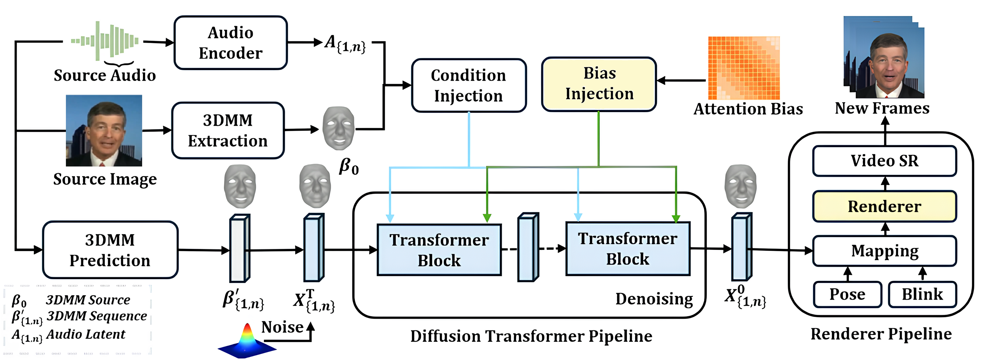
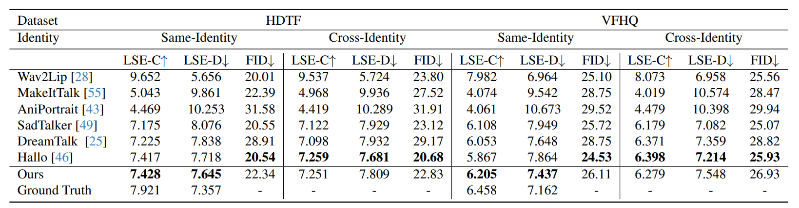

# MoDiT: Learning Highly Consistent 3D Motion Coefficients with Diffusion Transformer for Talking Head Generation

[](https://arxiv.org/abs/2507.05092)
[](https://modit-talkinghead.github.io/modit/)
[](https://creativecommons.org/licenses/by-sa/4.0/)

A novel framework combining **3D Morphable Model (3DMM)** with a **Diffusion-based Transformer** to address challenges in audio-driven talking head generation.
  
---

## 🔥 Overview

**MoDiT** is a framework designed to generate realistic and consistent talking heads from audio and a single image. It addresses the following challenges:

- **Temporal jittering**: Weak temporal constraints causing frame inconsistencies.
- **Identity drift**: Insufficient 3D information leading to poor facial identity preservation.
- **Unnatural blinking**: Inadequate modeling of realistic blink dynamics.

### 🚀 Key Contributions

1. **Hierarchical denoising strategy**:
   - Revised temporal attention and biased self/cross-attention mechanisms.
   - Improved lip synchronization and full-face coherence.
   
2. **Integration of 3DMM coefficients**:
   - Explicit spatial constraints for accurate 3D-informed optical flow prediction.
   - Enhanced identity consistency and lip synchronization.

3. **Refined blinking strategy**:
   - Modeled natural eye movements, resulting in smoother, more realistic blinking behavior.

---

## 📄 Abstract

Audio-driven talking head generation is critical for applications such as virtual assistants, video games, and films. Despite progress in this field, challenges remain in producing both consistent and realistic facial animations.  
To address these issues, **MoDiT** introduces a novel framework that combines the **3D Morphable Model (3DMM)** with a **Diffusion-based Transformer**, achieving state-of-the-art performance.  

## 🛠️ Methods

### Diffusion Transformer Pipeline



---

## 📊 Experiments

- **Comparison with state-of-the-art methods**:
  - Results on HDTF and VFHQ datasets show significant improvements in lip synchronization, identity preservation, and realistic facial animations.
  


---


## 📚 Citation

If you use this work, please cite:

```bibtex
@article{modit2025,
  author    = {Yucheng Wang and Dan Xu},
  title     = {MoDiT: Learning Highly Consistent 3D Motion Coefficients with Diffusion Transformer for Talking Head Generation},
  journal   = {arXiv preprint arXiv:2507.05092},
  year      = {2025},
}
